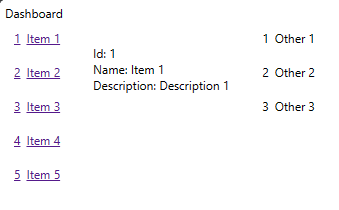

# How to add components

In this section, we learn how to add different components to create a single page application (SPA).

It's common practice to create a folder -- peer to the 'app' folder -- of react components. These can be client or server components (CSR, SSR). I'm one for brevity, so I'm naming the components folder 'ui'.

In here, we create components of the UI. The basic form of a component is:

```
// client or server directive:
'use client'

// imports...
import React from 'react';

export default function ComponentName(params) {
  // local vars
  // ...

  // hooks
  // ...

  // functions
  // ...

  return (
    <div>
    {/* ...more mark up here... */}
    </div>
  )
}
```

For this step, we created three components:
1. ItemList: a list of items
2. ItemDisplay: a component to display details of an item
3. OtherItemList: another list of items unrelated to the first two components

They have all been arranged / laid out in the page.js:

```
    <div className='flex flex-row'>
      <ItemList />
      <ItemDisplay itemId={1}/>
      <OtherItemList/> 
    </div>
```

Note: Actually, we wrapped them in a "DashboardPage" component which was referenced in page.js.

The resulting page looks:

